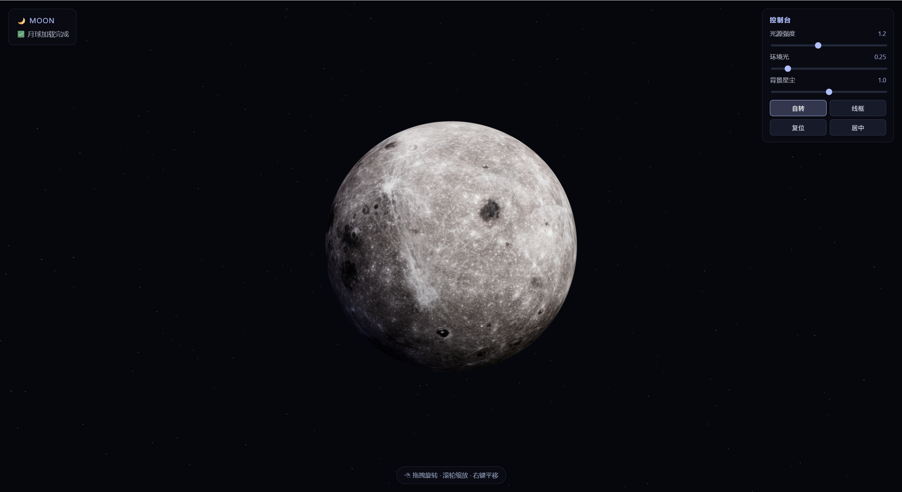
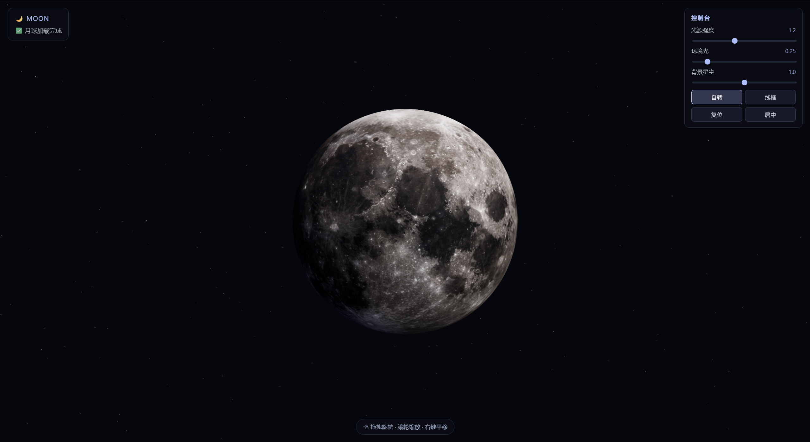
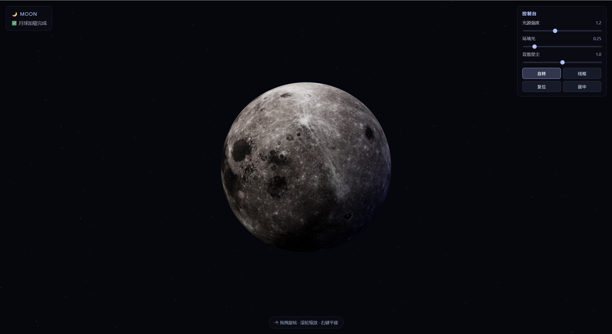

# 🌙 Moon 3D Viewer

基于 Three.js 的交互式月球 3D 预览。

## 📸 演示





## ✨ 功能

- 鼠标拖拽旋转、滚轮缩放、右键平移
- 自动旋转 / 线框模式切换
- 实时调节光源、环境光、星尘密度
- 自动居中并适配任意 GLB 模型
- ACES Filmic 电影级色调映射

## 🚀 本地启动

在 `moon` 目录下启动 HTTP 服务器（二选一）：

```bash
# Python 3
python -m http.server 8080

# Node.js
npx http-server -p 8080 -c-1
```

浏览器打开：

```
http://localhost:8080/index.html
```

> ⚠️ 不能直接双击 `index.html`，必须通过 HTTP 服务器访问（ES Module + fetch 限制）。

## 🌐 在线预览

[https://evedensity.github.io/moon3D/](https://evedensity.github.io/moon3D/)
